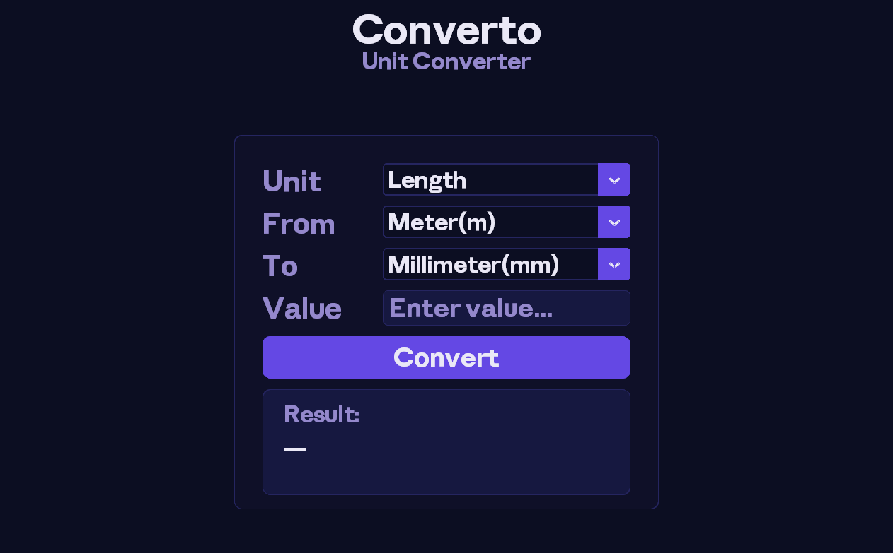
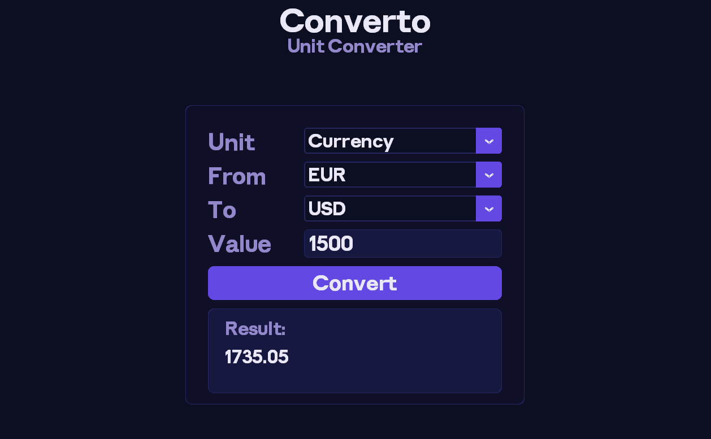
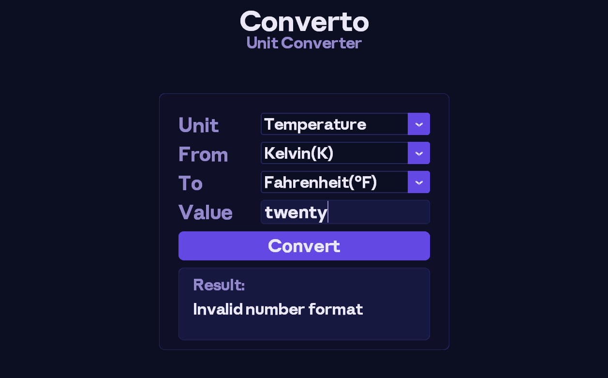

# Converto


A modern, elegant desktop unit and currency converter built with Python and CustomTkinter. Converto features a premium dark UI with a custom display font to handle your everyday unit conversion needs offline, and currency rates online.




## Features

- **Multi-Category Conversion** - Easily switch between 11 different categories:
  - Currency (requires internet connection for real-time rates)
  - Length
  - Mass
  - Volume
  - Temperature
  - Energy
  - Power
  - Pressure
  - Speed
  - Digital Storage
  - Data Transfer Speed
- **Live Currency Rates** - Real-time currency conversion pulling data from public APIs.
- **Premium UI** - Sleek dark mode design utilizing the custom `Anthropic Sans Display` font.
- **DPI Awareness** - Crisp window scaling support on Windows.

## Installation

### Download Executable

You can run `Converto.exe` directly from the project directory. No Python setup or dependency installation required.


## Usage

1. **Select Category**: Choose a category from the dropdown menu (e.g., Length, Currency, Speed).
2. **Choose Units**: Select the "From" and "To" units from their respective dropdown menus.
3. **Enter Value**: Type the numeric value you wish to convert in the "Value" input field.
4. **Convert**: Click the "Convert" button to see the formatted result instantly.

## Project Structure

```
Converto/
├── Anthropic Sans-fontiko/   # Folder containing Anthropic Sans 
├── main.py                   # Main application code
├── icon.ico                  # Application icon
├── README.md                 # This file
├── Screenshot_Currency.png   # App screenshot (Currency view)
├── Screenshot_default.png    # App screenshot (Default view)
├── Screenshot_invalid.png    # App screenshot (Error handling view)
```

## Technology Stack

- **Python 3.14+** - Programming language
- **CustomTkinter** - Modern UI framework
- **Requests** - API querying for real-time currency rates

## Contributing

Contributions are welcome! Please feel free to submit a Pull Request.

## License

This project is licensed under the MIT License - see the [LICENSE](LICENSE) file for details.
